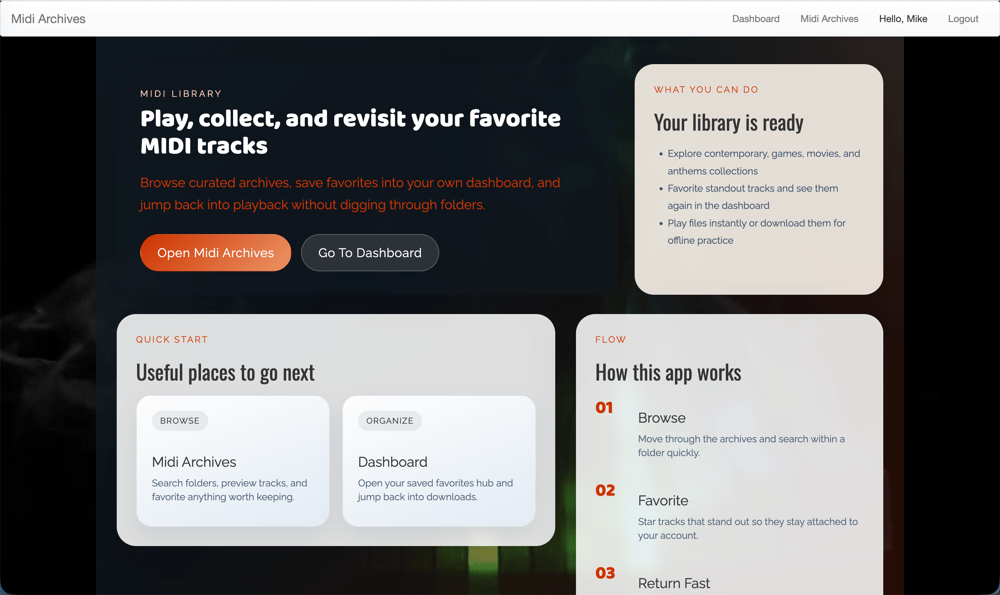
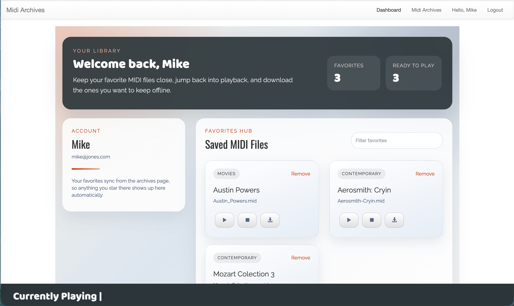
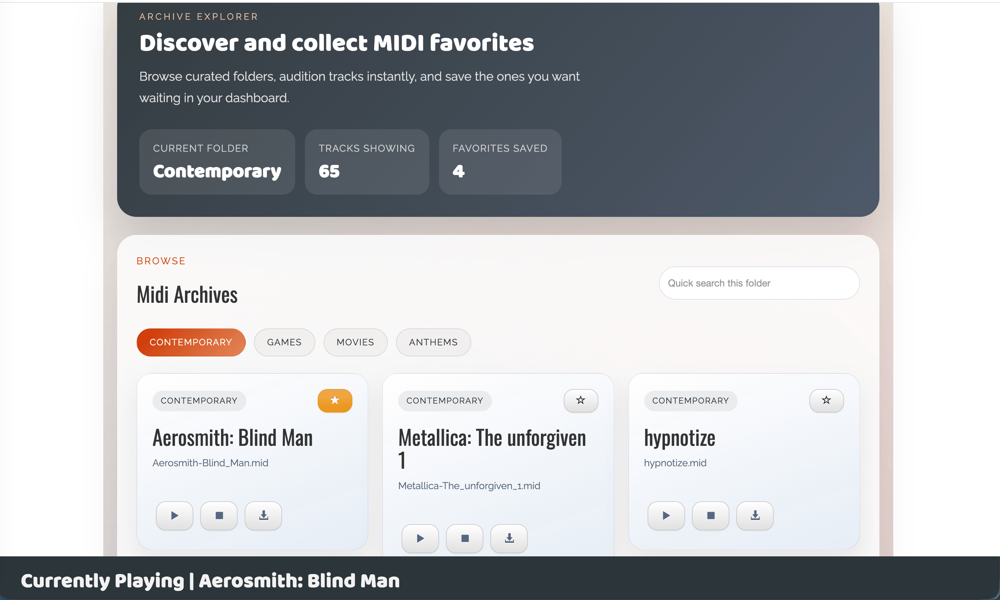

# Midi Archives

A full-stack MIDI library app built with React, Redux, Express, and SQLite.

The app lets users create an account, browse curated MIDI folders, preview tracks in the browser, download files, and save favorites to a personal dashboard.

## Features

- Account signup and login with JWT-based authentication
- Protected dashboard for viewing saved favorite MIDI files
- MIDI archives explorer with category tabs, in-page search, playback, download, and favorite actions
- Favorites synced to a local SQLite database
- Simple Express API for auth, favorites, and archive browsing

## Screenshots

### Home



### Dashboard



### MIDI Archives



## Getting Started

### Prerequisites

- Node.js
- npm

### Install dependencies

```bash
npm install
```

### Environment variables

This project works without extra configuration, but you can override these values:

- `PORT`: Express server port. Defaults to `3000`
- `JWT_SECRET`: Secret used to sign auth tokens
- `SQLITE_PATH`: Custom path for the SQLite database file

Example:

```bash
export JWT_SECRET="change-me"
export SQLITE_PATH="./data/app.db"
```

### Run in development

```bash
npm start
```

This starts:

- Webpack in watch mode
- The Express server with `nodemon`

Open `http://localhost:3000`.

### Demo account

The app seeds a demo user when the SQLite database initializes, so visitors can try the protected dashboard and MIDI archive flow without signing up.

- Username: `demo`
- Password: `demo-password`

### Run in production mode

```bash
npm run build
npm run start:prod
```

## How It Works

1. Users sign up and log in through the auth routes.
2. Authenticated users can open the MIDI archives and browse available folders.
3. Tracks can be played in-browser, downloaded, or added to favorites.
4. Favorited files are saved to SQLite and surfaced again in the dashboard.

## Project Structure

```text
client/        React components, Redux actions, reducers, and routes
server/        Express routes, auth middleware, and SQLite helpers
public/        Static assets including MIDI files, images, and video
dist/          Webpack build output
screenshots/   README screenshots
```
